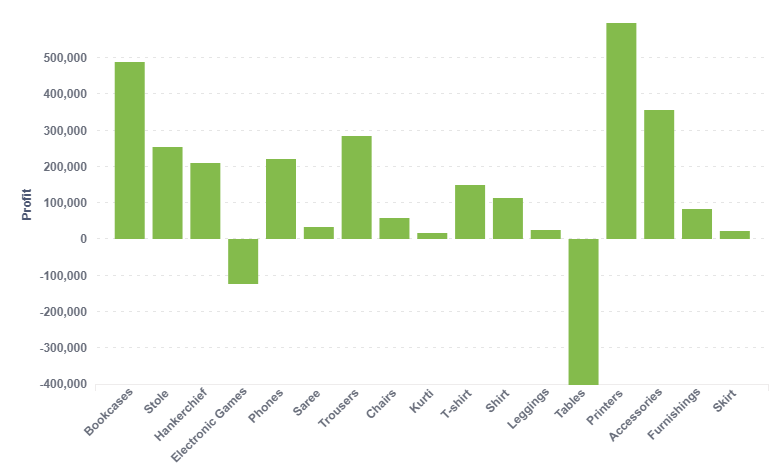

------------------------------------------------------------------------

title: "Bilgi Yönetim Sistemleri - Bitirme Projesi Rapor : İsmet Koçer 190401010,Uğur Öztürk 200401086,Ahmet Akkoç 200401044,Gamze Kocaman 190401022." output: html_document date: "2024-05-23"

## Q1 : İş probleminin tanımı

Biz, firmaların satış verilerini kullanarak kârlarını artırma amaçlı yöntemler uyguluyoruz ve sonuçları tahmin şeklinde sunuyoruz. Bu süreçte, **Metabase** adlı BYS platformunu kullanıyoruz. Metabase'i tercih etme nedenimiz, gelişmiş görselleştirme yöntemlerine sahip olmasıdır. Bu süreçte, *SQL Server* bağlantı ve verileri görselleştirebilme özelliklerinden yararlanacağız.

## Q2 : İş problemini çözmede kullanılacak data seti

Veri setimizi Kaggle'den elde ettik.

Hindistan’dan bir e-ticaret satış veri setimiz var ve toplam 88.23 kB boyutunda 2 CSV dosyasını içeriyor: List of Orders, Order Details. Hintli bir öğrencinin üniversitesinden aldığı veri kümesi olup, orijinal yazarı bilinmiyor.

İçeriği:

List of Orders: Bu veri seti, satın alma bilgilerini içerir. Bilgiler arasında Satın Alma Kimliği, Satın Alma Tarihi ve müşteri detayları bulunur. Order Details: Bu veri seti, sipariş kimliği, sipariş fiyatı, miktarı, karı, ürün kategorisi ve alt kategorisi ile birlikte sipariş bilgilerini içerir.

## Q3 : Veri seti keşifsel anazalizi

Veri setimizin önemli sütunları: OrderID, Amount, Profit, Quantity. OrderID veri tipi string, geri kalanlar float veri tipindedir. List of orders tablosunda boş satırlar mevcuttur. Bu satırların temizlenmesi gerekmektedir. Tablonun sonunda 60 satır boş veri bulunmaktadır. Tablonun genelinde tekrar eden böyle bir durum yoktur.

#### Boş satırların silinmiş hali

```{r, echo = FALSE, include = FALSE}
library(odbc)

#con <- dbConnect(odbc(),
#                 driver = "{ODBC Driver 17 for SQL Server}",
#                 server = "localhost",
#                 database = "master",
#                 uid = "sa",
#                 pwd = "n123aSd567ytu*",
#                 port = 1433)

#listoforders <- dbGetQuery(con, "SELECT * FROM [List of Orders]")
#orderdetails <- dbGetQuery(con, "SELECT * FROM [Order Details]")

library(RSQLite)
# Verileri size ulaştırabilmek için sql servera bağlanıp tabloları sqlite olarak proje dosyalarının içine kaydettik.
litecon <- dbConnect(RSQLite::SQLite(), "inst/extdata/database.sqlite")

#dbWriteTable(conn = litecon, name = "listoforders1", value = listoforders, row.names = FALSE,overwrite = TRUE)
#dbWriteTable(conn = litecon, name = "orderdetails1", value = orderdetails, row.names = FALSE,overwrite = TRUE)

listoforders1 <- dbGetQuery(litecon, "SELECT * FROM [listoforders1]")
orderdetails1 <- dbGetQuery(litecon, "SELECT * FROM [orderdetails1]")

library(dplyr)

temizlenmis_tablo <- listoforders1 %>%
                     filter_all(any_vars(. != ''))
DBI::dbDisconnect(litecon)
#DBI::dbDisconnect(con)


```

```{r}
temizlenmis_tablo
```

### Sub-Category başına toplam kâr-zararı buluyoruz.

```{r, echo = FALSE, include = FALSE}
gruplanmis_profit <- orderdetails1 %>%
                       group_by(`Sub-Category`) %>%
                       summarize(Toplam_Profit = sum(Profit))
```

```{r}
gruplanmis_profit
```

### Üstteki tablonun Metabase'de oluşturulan grafiğinin gösterimi(Kâr-zarar tablosu)

```{r, echo = FALSE}
#library(htmltools)
#library(htmlwidgets)

#metabase_iframe <- '<iframe
#    src="http://localhost:3000/public/question/53823ca0-b248-4690-8515-fff458f160d7"
#    frameborder="0"
#    width="800"
#    height="600"
#    allowtransparency
#></iframe>'

#widget <- HTML(as.character(HTML(metabase_iframe)))
#widget

#Normalde bu kodlarla direkt çekerek html olarak gösteriyoruz fakat sizin bilgisayarınızda gözükebilmesi için üstteki kodları çalıştırıp çıkan html'i png haline getirerek dosyaların arasına koyduk.




```

### Zarar eden satışların oranı

```{r, echo = FALSE}
library(dplyr)

negatif_profit <- orderdetails1 %>%
                    filter(Profit < 0)

negatif_satir_sayisi <- nrow(negatif_profit)

toplam_satir_sayisi <- nrow(orderdetails1)

oran <- negatif_satir_sayisi / toplam_satir_sayisi

print(oran)
```

### Şirketin toplam kârı

```{r, echo = FALSE}
library(dplyr)

toplam_profit <- sum(orderdetails1$Profit)

print(toplam_profit)


```

## Q4: Veri setinin BYS platformuna ithali

Kullandığımız BYS platformu Metabase. Metabase'e veri aktarabilmek için bir veritabanı bağlamamız gerekiyordu. Bu yüzden Docker'a bir SQL Server konteynırı kurduk. Bu SQL Server'a veri setimizi yükledik. Metabase'den veri tabanımızın bağlantı bilgilerini kullanarak bağlantı sağlayarak BYS platformumuza veri setimizi ithal etmiş olduk.


